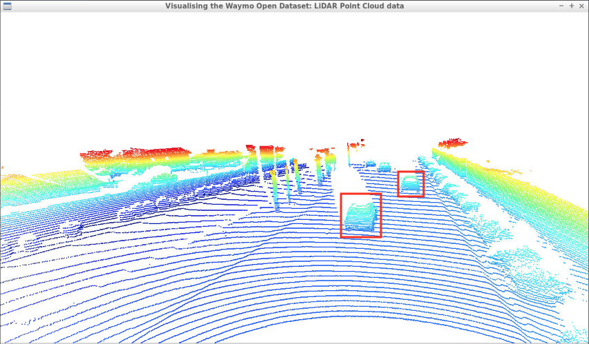
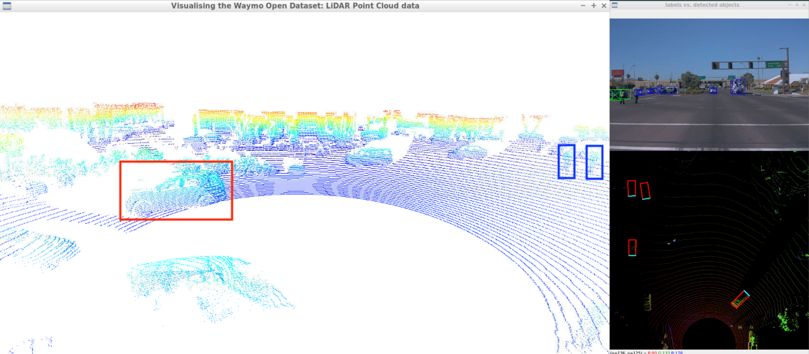
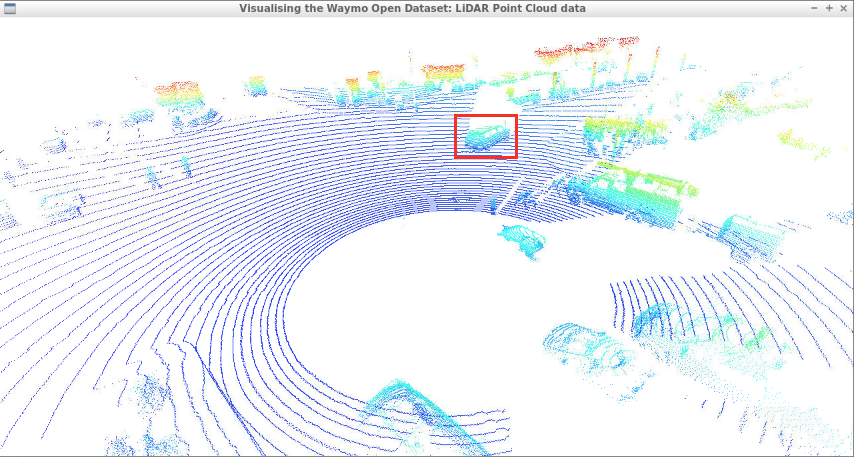
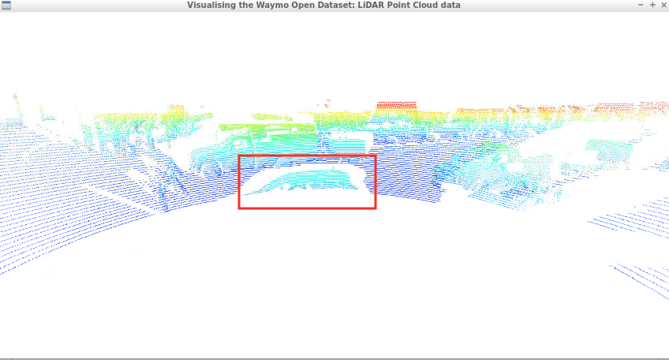
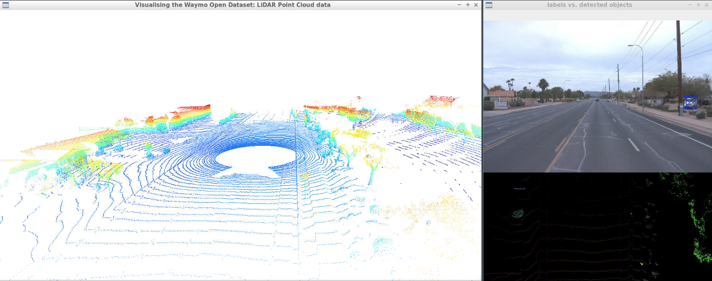
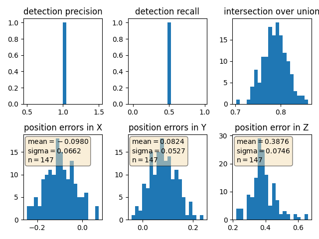
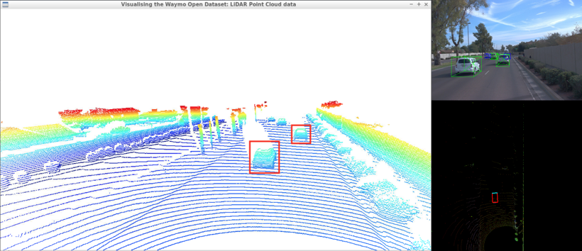

# Project 2.1: 3D Object Detection with LiDAR Data
## Midterm Report


## Introduction
In this project, we explored 3D object detection using LiDAR point cloud data from the Waymo Open Dataset. The goal was to build a functional perception pipeline capable of converting raw LiDAR range images into 3D point clouds and detecting vehicles using pre-trained deep learning models. We implemented supporting utilities for dataset parsing, sensor preprocessing, visualization, and model evaluation.

For data preprocessing, we constructed pseudo-RGB represnetations (range images) using LiDAR's range, intensity, and density channels. Two normalization methods were tested: min-max and percentile-based. These pseudo-images were used as input to pre-trained detectors such as SFA3D with a ResNet-18 FPN backbone and Complex-YOLO. These models predicted output bounding boxes in 3D space as $(x, y, z, w, h, l, \text{yaw})$ which were transformed from BEV image space to real-world coordinates and visualized alongside camera and point cloud views


## Exploratory Data Analysis (EDA)
To better understand the dataset and its sensor characteristics, I conducted exploratory analysis across multiple segment files from the Waymo Open Dataset. The goal was to visually inspect the LiDAR point cloud and range image data to identify patterns, limitations, and key features relevant to 3D object detection.

### Vehicle Visibility in LiDAR Point Cloud Data
The first part of the analysis focused on evaluating vehicle visibility under different conditions. We manually analyzed a series of frames that highlight both clear and challenging visibility scenarios across diverse scenarios which include vehicles fully visible in the open field of view, partially occluded by other objects or sensor blind spots, and those at long distances where LiDAR returns become sparse. By comparing these robust scenarios, we gained insight into how factors like occlusion, proximity, and sensor angle impact the fidelity of the LiDAR data—key considerations when designing or evaluating object detection models.

#### Good visibility

Vehicles directly in front or to the side of the ego-vehicle appeared clearly in the point cloud, with well-defined rear-ends, headlights, and vehicle bodies. Examples for reference are as follows:

We can clearly identify the vehicles in front of the Waymo ego vehicle in the following point cloud image of the front view of the Waymo vehicle. 



$$
\begin{align}
\textrm{Figure 1. Point cloud obtained from the front-view, here the rear-end of the cars in front of the Waymo vehicle are clearly visible (shown in red).}
\end{align}
$$

There are pedestrians (in blue) in the middle of the intersection controlling traffic. The oncoming vehicles to the left of the Waymo vehicle are clearly visible (in red) in the followng scene the vehicle is approaching a controlled intersection. 



$$
\begin{align}
\textrm{Figure 2. Point cloud of the front-left view, here the opposing traffic (shown in red) and pedestrians in the intersection (shown in blue) are clearly visible.}
\end{align}
$$


as well to the right of the Waymo vehicle taking a right turn (in red).



$$
\begin{align}
\textrm{Figure 3. Point cloud of the front-right view, here an adjacent vehicle (shown in red) in the controlled intersection is clearly visible while it completes a right-turn.}
\end{align}
$$

#### Poor visibility
#### Blind spots
Vehicles partially occluded by others or near blind spots (e.g., right-rear) were harder to identify due to LiDAR coverage limitations. Examples for reference are as follows:
A vehicle adjacent to the Waymo car is almost entirely occluded in the sensor’s right-side view, demonstrating one such vulnerability in the example below



$$
\begin{align}
\textrm{Figure 4. Point cloud of the front-right view, here an adjacent vehicle at the intersection is almost completely occluded by the blindspot directly surrounding the Waymo vehicle.}
\end{align}
$$


We can clearly make out important road features, e.g., the concrete raised traffic median in this example. However, an adjacent truck-and-trailer combination is only partially visible due to sensor occlusion near the vehicle body.


$$
\begin{align}
\textrm{Figure 5. Point cloud of the rear-view, here an adjacent vehicle (truck-and-trailer, shown in red) is only partially visible due to the blindspot.}
\end{align}
$$

#### Distance
Distant objects, such as parked semi-trucks on shoulders, often went undetected due to sparse LiDAR point clouds despite being visible in RGB images. Examples for reference are as follows:
A semi-truck parked on the paved shoulder  went undetected by the LiDAR unit due to poor resolution, despite being labeled in the ground truth in the example below. The semi-truck appears to be clearly distinguishable from the RGB images in this example.



$$
\begin{align}
\textrm{Figure 6. Point cloud of front-view, here a semi-truck (shown in blue in the RGB image, right) parked on the paved shoulder along the corridor goes undetected by the LiDAR sensor units.}
\end{align}
$$

This analysis revealed how vehicle visibility degrades with occlusion, proximity, and angle, justifying the need for multi-modal sensor fusion 

### Vehicle Landmarks in LiDAR Range Images
In this analysis, using the intensity channel of LiDAR range images we identified vehicle features that have consistent, highly distinguishable appearances across the frames, making them useful for detection and tracking modules

#### License plates
License plates is highly reflective and are prominent in intensity channels and consistently visible in rear views as bright spots, making them reliable indicators.

#### Windshields
Windshields appeared as `dark patches` / `void` due to low reflectivity. This characteristic absence helps distinguish between different parts of the vehicle structure and even detect vehicle orientation.

### LiDAR Range Image Pre-Processing
Before we move onto the next task, performing inference over the converted BEV image maps, let's briefly discuss the data pre-processing we have done in order to make the range images a bit clearer.

To improve clarity in visualizations and model input, we normalized the intensity channel using:

- **Min-max normalization**: Scales all values between 0 and 255.
- **Percentile normalization (1st and 99th)**: More robust to outliers and saturation effects.

We found percentile-based normalization produced cleaner, more informative range images, particularly for distinguishing vehicle surfaces.


#### Intensity Normalization Formulas

Below are the Python code snippets used for each normalization method:

**Min-max normalization:**
```python
# Min-max normalization on intensity values
scale_factor_intensity = np.amax(ri_intensity) - np.amin(ri_intensity)
ri_intensity_scaled = ri_intensity * np.amax(ri_intensity) / 2
ri_intensity_scaled = ri_intensity_scaled * 255. / scale_factor_intensity
```

**1st and 99th percentile normalization:**
```python
# 1st–99th percentile normalization
ri_min = np.percentile(ri_intensity, 1)
ri_max = np.percentile(ri_intensity, 99)
np.clip(ri_intensity, a_min=ri_min, a_max=ri_max)
ri_intensity_scaled = np.int_((ri_intensity - ri_min) * 255. / (ri_max - ri_min))
```

We found that percentile normalization significantly improved interpretability by limiting the effect of extreme values—especially important for regions with specular reflections like license plates or retroreflective surfaces.

---

### Implementation Details

#### Switching Between Sequence Files

To switch between `Sequence 1`, `Sequence 2`, or `Sequence 3` from the Waymo Open Dataset, update the relevant filenames in `loop_over_dataset.py`:
```python
# Waymo segment file selection
# Sequence 1
# data_filename = 'training_segment-1005081002024129653_5313_150_5333_150_with_camera_labels.tfrecord'
# Sequence 2
data_filename = 'training_segment-10072231702153043603_5725_000_5745_000_with_camera_labels.tfrecord'
# Sequence 3
# data_filename = 'training_segment-10963653239323173269_1924_000_1944_000_with_camera_labels.tfrecord'
```

Then, update the `configs.rel_results_folder` path in `objdet_detect.py` to match the results folder for that sequence. For example, for Sequence 2:
```python
configs.rel_results_folder = 'results_sequence_2_resnet'
```

This will direct output to the correct subfolder, e.g., `results/fpn-resnet/results_sequence_2_resnet/`.

---

#### Executing Specific Tasks

To visualize vehicle visibility in the LiDAR point cloud and compare it against BEV and camera views, modify `loop_over_dataset.py` like so:
```python
exec_data = []
exec_detection = []
exec_tracking = []
exec_visualization = ['show_pcl', 'show_objects_in_bev_labels_in_camera']
```

This opens:
- An Open3D window for 3D point cloud visualization
- An OpenCV window with RGB and BEV overlays

To explore LiDAR range images and intensity patterns:
```python
exec_data = []
exec_detection = []
exec_tracking = []
exec_visualization = ['show_range_image']
```

This launches a frame-by-frame OpenCV viewer rendering the LiDAR range image with intensity values, allowing you to inspect features such as license plates, windshields, and vehicle outlines.


## Inference and Results
We evaluated the SFA3D model with a ResNet-18-based Keypoint Feature Pyramid Network (KFPN) backbone on `Sequence 1` from the Waymo Open Dataset (frames 50–150). Detection results showed high precision, recall, and IoU, with slightly lower accuracy along the z-axis.


The following detection results have been observed for the Sequence 1 clip from the Waymo Open Dataset across (frames 50-150).

```python
# Sequence 1 file used for evaluation
data_filename = 'training_segment-1005081002024129653_5313_150_5333_150_with_camera_labels.tfrecord'
```

### Detection Performance Metrics

Below is the performance visualization for the model on the selected sequence. It includes standard detection metrics such as **Precision**, **Recall**, and **Intersection over Union (IoU)**, as well as histograms for spatial error along the $x$, $y$, and $z$ axes.



$$
\begin{align}
\textrm{Figure 9. Performance metrics for the pre-trained SFA3D model with FPN ResNet-18 on Waymo range images.}
\end{align}
$$

- **Precision and Recall:** Near-perfect scores indicating robust detection consistency.
- **IoU:** High overlap between predicted and ground-truth bounding boxes.
- **Error Histograms:** Low positional errors in $x$ and $y$, slightly higher in $z$ (depth), likely due to reduced LiDAR fidelity for small vertical surfaces or occluded structures.

Despite being trained on KITTI, the model demonstrated strong cross-dataset generalization to Waymo data. While our initial evaluation results look strong, further analysis needs to be performed across other segment files.

### Bounding Box Predictions

We visually assessed the model’s predictions on two representative frames. The bounding boxes predicted by the SFA3D model are shown in red in the BEV (Bird’s Eye View) visualizations. Ground truth labels, when available, are shown in green in the RGB image projections.



$$
\begin{align}
\textrm{Figure 10. Evaluation Frame 1 — BEV and RGB annotations overlaid with predicted 3D bounding boxes.}
\end{align}
$$


$$
\begin{align}
\textrm{Figure 11. Evaluation Frame 2 — BEV and RGB annotations overlaid with predicted 3D bounding boxes.}
\end{align}
$$

These visual results confirm tight alignment of predicted boxes with visible vehicles. Minor drifts in orientation and depth are observed in cluttered or partially occluded scenes, but ground-truth labels have been preserved in their 3D format with respect to the camera sensor space. 

## Closing Remarks

### Alternatives Considered
- Evaluation of other sequence files from Waymo to generalize conclusions.
- Testing different pre-trained architectures (e.g., DarkNet-based Complex-YOLO).

### Potential Extensions
- Add comparative benchmarking with other models like Complex-YOLO.
- Conduct fine-tuning of the SFA3D model on Waymo-specific distributions.
- Visualize predictions in camera space for deeper calibration validation.


## Future Work

- ✅ Visualize BEV and camera-space predictions for more segment files.
- ⬜️ Evaluate SFA3D across additional Waymo sequences.
- ⬜️ Benchmark against Complex-YOLO and other architectures.
- ⬜️ Fine-tune existing models using domain-specific Waymo data.


This assignment was prepared by Dr. Andreas Haja and Dr. Antje Muntzinger et al., 2021 (link [here](https://github.com/udacity/nd013-c2-fusion-starter)).

References
* [1] Sun, Pei, et al. Scalability in Perception for Autonomous Driving: Waymo Open Dataset. arXiv. 2019. [doi:10.48550/ARXIV.1912.04838](https://arxiv.org/abs/1912.04838).
* [2] Zhou, Q-Y, et al. Open3D: A Modern Library for 3D Data Processing. arXiv. 2018. [doi:10.48550/ARXIV.1801.09847](https://arxiv.org/abs/1801.09847).
* [3] He, K., et al. Deep Residual Learning for Image Recognition. IEEE Conference on Computer Vision and Pattern Recognition (CVPR). 2016. [doi:10.1109/CVPR.2016.90](https://doi.org/10.1109/CVPR.2016.90).
* [4] Peixuan, L., et al. RTM3D: Real-time Monocular 3D Detection from Object Keypoints for Autonomous Driving. arXiv. 2020. [doi:10.48550/arXiv.2001.03343](https://arxiv.org/abs/2001.03343).
* [5] Simon, M., et al. Complex-YOLO: Real-time 3D Object Detection on Point Clouds. arXiv. 2018. [doi:10.48550/arXiv.1803.06199](https://arxiv.org/abs/1803.06199).
* [6] Olsen, M. J., et al. Lidar for Maintenance of Pavement Reflective Markings and Retroreflective Signs: Vol. 1 Reflective Pavement Markings. No. FHWA-OR-RD-19-01. Oregon Department of Transportation. 2018. [https://rosap.ntl.bts.gov/view/dot/36526](https://rosap.ntl.bts.gov/view/dot/36526).
* [7] Geiger, A., et al. Vision Meets Robotics: The KITTI Dataset. International Journal of Robotics Reearch, 32(11):1231-1237. 2013. [doi:10.1177/0278364913491297](https://doi.org/10.1177/0278364913491297).